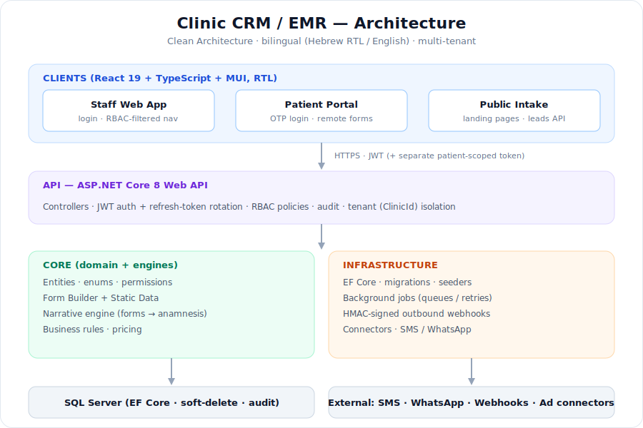

# 🏥 Clinic CRM / EMR — Project Showcase

A bilingual (**Hebrew RTL / English**) clinic management platform I designed and built — full-stack, engine-driven, multi-tenant.

> 🔒 **This is a public showcase, not the source.** The code and any real data are kept private. Everything here is a high-level overview; all screenshots use **demo data only**.

---

## 📋 Overview / סקירה

🇬🇧 A management system for a physiotherapy / clinic setting: scheduling, patient records, a smart **intake → clinical narrative** engine, a leads CRM, billing/procurement, a patient self-service portal, and reporting. The guiding idea is **engines over screens** — most clinical features are *composed* from a form builder, lookup data and a narrative engine, instead of being hard-coded.

🇮🇱 מערכת ניהול למרפאה: יומן תורים, תיק מטופל, מנוע **שאלון חכם → אנמנזה קלינית**, CRM לידים, חיוב/רכש, פורטל מטופלים לשירות עצמי, ודוחות. הרעיון המנחה — **מנועים במקום מסכים**: רוב היכולות הקליניות מורכבות ממחולל טפסים, רשימות ערכים ומנוע נרטיב, במקום קוד קשיח.

---

## 🏗️ Architecture

Clean Architecture split into **Api / Core / Infrastructure**, a React SPA on top, SQL Server underneath, and background jobs + signed webhooks for outbound integrations. Auth is JWT with refresh-token rotation; the patient portal uses a **separate, patient-scoped token** that is rejected by staff endpoints. Tenancy is enforced per `ClinicId`.

---

## 🧩 Modules

| Domain | Highlights |
| ------ | ---------- |
| **Engines** | Form Builder · Static Data (lookups) · Narrative engine (structured answers → Hebrew clinical text with conditionals) |
| **Patients** | Full medical record, visits, collapsible intake sections, smart questionnaires |
| **Scheduling** | Multi-clinic / rooms / practitioners, daily & weekly views, status coloring, allocations, preliminary-check (PTA) columns |
| **CRM — Leads** | Configurable statuses / sources / fields, public intake API, duplicate detection, activity timeline, saved views, campaigns |
| **Business Partners** | Unified ERP-style card (customer / supplier / lead), lead→customer conversion, price lists & discounts |
| **Finance** | Procurement cycle + supplier A/P balance |
| **Documents** | Templates, generation, **digital signature** |
| **Patient Portal** | OTP login, remote questionnaire filling, personal dashboard, staff "send to portal" (SMS / WhatsApp), remote signing |
| **Reporting** | Report builder (group-by / aggregate / filters), Excel export, pinned dashboard widgets |
| **Growth** | Hosted landing-page builder → leads, ad connectors, HMAC-signed outbound webhooks |
| **Admin** | Visual per-module permission matrix, user / role / group management |

---

## 🛠️ Tech & Engineering

- **Backend:** ASP.NET Core 8 Web API, EF Core, SQL Server, JWT + refresh rotation, RBAC policies.
- **Frontend:** React 19 + TypeScript + Vite + MUI (full RTL) + react-i18next (he/en live switch).
- **Cross-cutting:** universal audit, global soft-delete, multi-tenant isolation, background job queue with retries.
- **Quality:** GitHub Actions CI (build + tests for backend, build for frontend), EF migrations, unit tests.

---

## 🖼️ Screenshots

> Demo data only — no real patients.

| | |
| --- | --- |
| _Add `assets/01-dashboard.png`_ | _Add `assets/02-calendar.png`_ |

<!-- Drop demo-data screenshots into assets/ and reference them here, e.g.:

-->

---

## 🔐 Privacy & scope

This repository intentionally contains **no source code, no schema, no secrets, and no real data**. It exists to document the project and my role in building it. Implementation details are available on request in a suitable setting.

---

Built and maintained by <a href="https://github.com/galasulin">@galasulin</a>.
