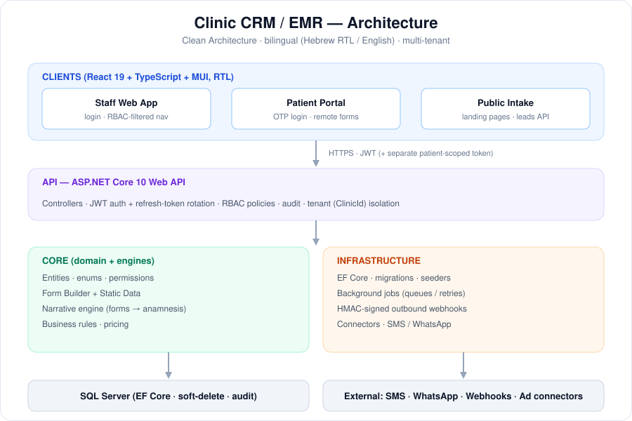

# 🏥 Clinic CRM / EMR — Project Showcase

  <a href="README.md">🇬🇧 </a>
  &nbsp;
  <a href="README.he.md">🇮🇱 </a>

A bilingual (**Hebrew RTL / English**) clinic management platform I designed and built — full-stack, engine-driven, multi-tenant, and now telephony- and AI-enabled.

> 🔒 **This is a public showcase, not the source.** The code and any real data are kept private. Everything here is a high-level overview; all screenshots use **demo data only**.

---

## 📋 Overview

A management system for a physiotherapy / clinic setting: scheduling, patient records, a smart **intake → clinical narrative** engine, a leads CRM with a **sales pipeline**, quotes/orders + billing, inventory & contracts, a **contact-center / telephony (CTI)** layer, a patient self-service portal, and a **self-service reporting & analytics platform** (report anything, schedule it, share it, ask it in plain language) — with an **AI assist layer** on top. The guiding idea is **engines over screens** — most features are *composed* from a form builder, lookup data and a narrative engine, instead of being hard-coded. It runs **real-time** (live calendar + push notifications over WebSockets), includes a **no-code automation** builder, and is packaged to run **on-premises as a single Windows Service** against a dedicated SQL server.

> 🇮🇱 גרסה עברית מלאה: [**README בעברית**](README.he.md)

---

## 🏗️ Architecture

Clean Architecture split into **Api / Core / Infrastructure**, a React SPA on top, SQL Server underneath, and background jobs + signed webhooks for outbound integrations. Auth is JWT with refresh-token rotation; the patient portal uses a **separate, patient-scoped token** that is rejected by staff endpoints. Tenancy is enforced per `ClinicId`. External integrations (telephony, AI, messaging, lead sources, calendar sync, motion-analysis data) are behind **provider-agnostic adapters**, each with a built-in "dev" simulator so the whole system runs end-to-end without any third-party account.

---

## 🧩 Modules

| Domain | Highlights |
| ------ | ---------- |
| **Engines** | Form Builder (incl. a repeatable **"add-row" table field**) · Static Data (lookups) · Narrative engine (structured answers → Hebrew clinical text with conditionals) |
| **Patients** | Full medical record, visits, collapsible intake sections, smart questionnaires, mailing-consent & referral panels, multi-signature **reception / intake forms** (admin-locked once signed), a **patient-relations** tab (linked family / related records), a **unified activity timeline** that merges appointments, invoices, service cases, logged calls/messages, tasks and documents into one chronological, per-source-filterable feed, and a **relationship health score** (0–100 engagement / drift risk from upcoming bookings, visit recency, no-shows, overdue balance and latest satisfaction) shown with every factor that produced it — computed on demand so it can never quietly go stale, and labelled a relationship measure rather than a clinical one |
| **Scheduling** | Multi-clinic / rooms / practitioners; daily / weekly (per-therapist) / monthly views; **live updates across users**; per-branch work hours + one-off exceptions; drag-move & drag-resize of appointments **and** blocks; visual allocations defined on the grid; preliminary-check (PTA) columns with computed arrival time; recurring series; **waitlist**; **two-way SMS** confirm/cancel; a new appointment's **branch auto-fills from the patient's recorded treating branch** (editable, with a mismatch warning); full Excel export by practitioner & date range |
| **Front-Desk Operations** | A live **waiting-room board** (expected / waiting with a running clock / in treatment / done / missed) that separates *waiting since arrival* from *kept past the slot* — a patient who came early and was seen on time is not a service failure; and an **end-of-day screen** for each practitioner: my sessions, who attended without a word of documentation, which past slots were never marked, and what tomorrow opens with. It reports, never edits — fixing happens in the diary and the record, one click away |
| **Group Sessions** | Classes with capacity (hydrotherapy, Pilates, workshops): a live seats bar, roster management, and a server-side lock so two clerks can't both fill the last place. **Every enrolment is an ordinary appointment**, so attendance, reminders, no-show tracking and reporting work untouched; removing a participant cancels (never deletes) and frees the seat |
| **Resource Booking** | An appointment can claim **equipment beyond its room** (treadmill, ultrasound unit, second bed) with one conflict check across rooms *and* devices — a room in use as a room is not free as a device, back-to-back bookings don't clash, and a busy resource shows as disabled rather than hidden |
| **Recurring Courses** | A whole treatment course booked as one object: the rule ("weekly x 12"), what remains, cancel-from-here-onward anchored to the occurrence you clicked (history is never rewritten), and reassigning the remainder to another practitioner with per-occurrence conflict checks — skips are reported by name, never swallowed |
| **Tasks & Automation** | Multi-assignee tasks, transfer, dependencies (A blocks B), SLA timers; a **no-code automation builder** (triggers → conditions → actions: reminders, escalation to a team manager, weighted round-robin routing, lead scoring). The engine is **stateful**: an action can carry a **time delay** ("wait N days, then…") — deferred with a frozen snapshot of the trigger context and executed later by a background tick, exactly once. **Commercial-pipeline triggers** (invoice issued / paid / overdue, low-satisfaction survey) turn billing and feedback events into follow-up work automatically |
| **Real-time** | System-wide live sync over SignalR: a single EF SaveChanges interceptor broadcasts every entity change to connected clients, so cards, lists, the calendar and forms refresh instantly across users — no polling, no per-screen wiring. Overlapping fields (e.g. a patient-card box and its questionnaire) stay in sync both ways from one source of truth |
| **CRM — Leads** | Configurable statuses / sources / fields, public intake API, duplicate detection **and a smart merge** (same phone in any format / same email → one survivor absorbs the timeline, tasks, quotes and empty fields; the duplicates land in the recycle bin, never lost), activity timeline, campaigns. A **drag-and-drop Kanban board** (columns = pipeline stages, dragging a card changes the stage and fires the matching automations) and **bulk actions** on the list (multi-select → reassign / set stage / export / recycle) |
| **Saved Views** | A reusable, per-screen **list-view engine** — capture the current filters + search + sort as a named preset, keep it private or **share it with the whole team**, and pin one as your default. Generic across list screens (service cases, tasks, invoices, partner cards and more) |
| **Global Search & Command Palette** | One box (**Ctrl/⌘-K** from anywhere) that searches **actual records across the whole system** — patients, leads, service cases, invoices, partner cards, tasks — grouped by type, ranked so prefix matches win, and digits-aware so a phone typed as `050-000 0000` finds a number stored as `0500000000`. Every section is gated by the caller's own view permission, so results can never reveal a module the user isn't allowed to open. The same box doubles as a **command palette**: permission-filtered quick actions (new patient / lead / task / appointment) that open the relevant dialog directly |
| **Collaboration** | Comments with **@mentions** on *any* record, **follow / unfollow** to be told when something you care about moves, and **file attachments** on records that previously couldn't take one (leads, cases, invoices, quotes, contracts, partner cards). Notifications respect **per-user preferences** — each person chooses which channels reach them, and an author is never pinged about their own comment. Uploads are constrained by an extension allow-list, a size cap, a server-generated storage name, and are always served as downloads rather than rendered inline |
| **Approvals** | A **generic approval workflow** attachable to any record type — a request carries what it's about, why, and how much; a manager works a single queue and approves or rejects with a note. A decision is final, and **nobody can approve their own request**; asking twice about the same thing reuses the open request instead of giving two managers racing copies |
| **Data Quality** | **Duplicate detection and smart merge for patients** (matched on national ID in any punctuation, phone, or identical name *plus* birthdate — a shared common name alone is never treated as evidence): every appointment, visit, invoice, form, case and document is re-pointed to the surviving file, the survivor always wins a genuine conflict, and merged files go to the recycle bin. A guided **import wizard** — pick a file, map each detected column (auto-guessed, with a sample value and an explicit marker when a column will *not* be imported), then a **dry run** that reports exactly what a real import would create, skip or flag as duplicate *before anything is written*. **Admin-configurable validation rules** on custom fields (pattern, message, range / length) enforced server-side, plus **bulk edit** from a list |
| **Record History** | Every write is captured as a field-level *old → new* diff, and surfaced **inside the record itself** — who changed which field, from what, to what, and when — in plain Hebrew field names, with system bookkeeping columns filtered out. Access stays behind the same governance permission as the central audit log |
| **Sales** | Quote → order → invoice document flow with **server-side pricing** (line + document discounts + VAT, recomputed on every save), per-year numbering, branded printable/PDF quotes; a **discount-approval workflow** (over-threshold discounts can't be sent until a manager approves — and raising the discount afterwards voids the approval); **guided selling** (per-stage checklists + next-best-action hints); a **weighted sales forecast** — pipeline value × stage probability by month / rep / stage; **monthly sales targets (quotas)** per rep with live attainment bars and one-click carry-over |
| **Service Desk (Cases)** | Numbered service tickets with an **SLA engine**: first-response and resolution targets derived from priority, live countdown chips, the first staff note stamps the response automatically, and a periodic sweep flags breaches exactly once — real-time alert to the assignee + an automation trigger for escalation (e.g. SMS the manager). Full timeline, status flow with reopen, linked to the patient/lead. Worked from a list **or a drag-and-drop Kanban board** with SLA-breach badges |
| **Omni-Channel Inbox** | Every inbound SMS / WhatsApp lands on **one conversation thread per phone number** (any formatting), auto-matched to the patient or lead. A two-pane chat UI with unread badges, agent assignment, inline reply through the right channel, close/reopen, and a jump to the patient file. An automation trigger fires on every inbound message — the hook for an auto-reply agent |
| **Email Campaigns** | Consent-enforced bulk email (audience filters, dedup, personalization) sent by a throttled background job, with **per-recipient open / click / unsubscribe tracking** (pixel + wrapped links) and a branded unsubscribe page that flips the contact's marketing consent off — compliance first. Live funnel chips on each campaign card |
| **Knowledge Base** | Searchable internal articles (procedures, call scripts) with categories, tags and view counts; articles marked "publish" surface on the patient portal as an FAQ via a PHI-free public endpoint |
| **Telephony / Contact Center (CTI)** | Provider-agnostic PBX integration: **screen-pop** on inbound calls (caller matched to patient/lead, one-click jump to the card), **click-to-call** from anywhere, a **live wallboard** of active calls, agent **queue login/logout** + break statuses, **call-recording mute** for sensitive data, **historical call-log sync** (idempotent), a **predictive-dialer** upload from the call queue, and **smart IVR routing** (recognized callers routed by an external-layer webhook with their name attached). Every call is journaled and linked to the patient/lead timeline |
| **AI Assist** | A generative layer behind a **pluggable multi-provider gateway** (three interchangeable LLM vendors + a dev simulator; provider, per-provider keys and model picked in the admin UI at runtime): message drafting, one-click lead & patient summaries, an **insights engine** (period-vs-period KPIs, auto findings with recommendations, an AI executive narrative and conversational "ask your data" grounded strictly in the clinic's numbers) and a **weekly executive digest email**; a **Next-Best-Action** panel on the patient record — a local **churn-risk** score computed from retention signals (visit recency, no-shows, open cases, unpaid balance, latest satisfaction) plus an AI-ranked list of concrete next steps, with a graceful heuristic fallback when no AI provider is configured; satisfaction-survey **sentiment routing** (a detractor auto-opens a recovery task / alerts a manager; a promoter can trigger a referral ask); **plus local predictive models trained on the clinic's own data** — lead scoring with human-readable reasons and appointment **no-show risk** — that need no external service and refresh nightly |
| **Motion Analysis (patient phone-app data)** | Gait data the patient records on their own phone through a third-party motion-analysis app — walk, sit-to-stand and timed-up-and-go tests, patient-reported questionnaires, and passive daily monitoring — pulled into the clinical record and laid out in the **same parameter language as the clinic's in-house gait lab**: translated labels, units, the clinic's own reference bands, and per-parameter comparison charts across visits. Every value the provider sends is read from the stored payload rather than from fixed columns, so a parameter the vendor adds later appears the day it starts arriving. What the integration **refuses** to do is the part worth describing: the provider's account holds every person who ever installed the app — thousands, almost none of them patients at this clinic — so **nothing is stored for anyone a human has not explicitly linked to a patient file**. Candidate matching asks the provider four narrow questions about *that one patient* (the unique external identifier, phone, full name, birth date), validates the national-ID check digit locally before sending it, and shows **why** each candidate surfaced — never linking automatically, because on the live roster 179 names repeat across 436 people and 46 pairs share a full name *and* a birth date. Unlinking takes the measurements out of the file — as a **soft delete**, restorable by an admin like every other record here, and re-linking revives those same rows instead of importing duplicates |
| **Voice of Customer (NPS)** | Tokenized **no-login survey pages** sent by SMS / email from any patient or lead card (or via automations); an NPS dashboard with the promoter / passive / detractor split, monthly trend and recent comments |
| **Business Partners** | Unified ERP-style card (customer / supplier / lead), lead→customer conversion, **tiered / per-customer price lists** & discounts |
| **Finance** | Procurement cycle + supplier **A/P** balance; a customer **A/R aging** report (0–30 / 31–60 / 61–90 / 90+ buckets); invoices carry a compliant tax-authority **allocation number** and render to a **server-side PDF** |
| **Inventory** | Products, warehouses, **stock movements** and low-stock alerts |
| **Contracts & Subscriptions** | Treatment packages / subscriptions with **automatic renewal billing**; **a package session is debited by marked attendance itself** — recorded on the visit so a bounced status can never double-charge, refunded when attendance is undone, and a missed visit never silently consumes an entitlement. The front desk is told exactly what happened ("session 4 of 10 used from package X") |
| **Documents** | Templates, generation, multi-party **tamper-evident digital signatures** (SHA-256 fingerprint over the document + signature + signer + trusted server timestamp, with a one-click *verify* that detects any post-signing edit), brand-framed forms rendered to **real PDF** client-side (and emailed as an attachment) |
| **Clinical Progress & Charting** | A deterministic **treatment-progress engine** over the patient's own longitudinal measurements (gait metrics + outcome questionnaires): per-metric verdicts — improving / declining / **plateau** (the one a clinician acts on) — with the full evidence series attached to every claim, a refusal to conclude anything from fewer than three points, and the direction of improvement **named per instrument** (pain scales score down, function scales score up; an unclassified instrument reports the change and refuses the conclusion). Plus a clickable **body chart** (relative coordinates, dated charts, read-only history with copy-forward) and a **clinical phrase library** inside every clinical text field — inject-to-edit, never auto-submit, with private and clinic-wide scopes enforced server-side. Both the body chart and the gait comparison reach the **printed visit summary**, not just the screen — a section the export doesn't know about renders in the app and vanishes from every document in silence. The figure is **drawn from the stored relative coordinates** rather than fetched as an image, so it costs no bytes and renders anywhere, and only the latest dated chart prints: stacking every session on one silhouette reads as a patient who never improved. The gait table is three fixed columns — the baseline consult and the latest measurement in each test condition — which never share a column, because they measure different things |
| **Clinical Documentation Assist** | **Dictation** runs on the browser's own speech recognition — no AI vendor, no key, no per-minute cost — and is **off by default**, because on some browsers the audio is transcribed by the vendor's cloud service, and for a note about a named patient that is a transfer of health data the clinic must decide on rather than a default the code picks. Separately, a **session summary** turns a dictated or pasted transcript into a structured clinical draft; it is the one generative endpoint that **refuses when no provider is configured** instead of returning the gateway's placeholder text — elsewhere a placeholder is a suggested message nobody sends, here it would be invented prose in a box labelled *clinical summary*, one click from a permanent record. The draft **exports as a document that says it is a draft**, in the title and in a band styled to survive printing, is never stored, and carries no integrity seal: a lock icon on a draft is a lie told in a reassuring font |
| **Fund Authorizations** | Health-fund approvals recorded on the file with validity and session caps — **usage is derived from attended visits in the window, never hand-kept**, so it cannot drift from the diary; an approval nobody touched still reports itself expired on its own date |
| **Records Retention** | A published retention period the clinic can actually stand behind, and a review report that lists the files that have passed it — **it reports and is structurally unable to delete**: a clinical record destroyed on a schedule is destroyed silently, and where case law shifts the burden of proof onto whoever failed to keep a record, deleting early costs far more than the disk it saves. A reflection test asserts the endpoint exposes no write verb at all, because adding one later would fail no behavioural test. Two holds are **computed rather than remembered** — a patient treated as a minor is kept well past the general period (their limitation clock starts at adulthood), and anything touching an open complaint is held until it closes — and a **missing date of birth holds too**, because "assume adult" is the assumption that clears a child's file early |
| **Staff Training** | An in-app curriculum (30 lessons covering every screen) read from the knowledge base — one content store, two views — with per-user progress and a manager onboarding view. Lesson content **tracks the code via a fingerprint**: an unedited lesson refreshes itself on deploy, an admin-reworded one is theirs forever |
| **Workforce** | Attendance-based practitioner earnings (rate x sessions counted from the diary), admin-gated; an unconfigured rate is flagged as *unknown*, never shown as zero — those look identical in a total and only one is a payroll problem |
| **Patient Portal** | OTP login, **self-booking of free slots**, remote questionnaire filling, personal dashboard, staff "send to portal" (SMS / WhatsApp), remote signing. Self-booking is governed by rules the clinic sets — minimum notice, booking horizon, cancellation window, how many open bookings one patient may hold, which services are offered at all, and whether to restrict to the patient's own practitioner and branch — **enforced in the endpoints and re-checked on booking**, never only drawn in the admin screen, because a filtered list of offers is bypassed by a hand-made request. An **empty allow-list offers nothing rather than everything**: an unconfigured list must not silently open first assessments to self-booking |
| **Reporting & Analytics** | A self-service **report builder over every value in the system** — built-in entity columns, custom fields, and *questionnaire* answers (including "add-row" table columns and multi-selects, exploded on the fly) are all groupable / filterable / aggregatable, with Hebrew labels on every field. Eight chart types plus a **two-dimensional pivot**; **time-bucketing** (day / week / month / quarter / year) with **period-over-period Δ%**; **multi-measure series** on one chart; **drill-through** from any aggregate straight to the underlying records; live auto-preview; Excel / CSV export; and a guarded **read-only SQL power tool** for admins (SELECT-only, sandboxed in an always-rolled-back transaction, row/time capped, fully audited). Saved reports can be **emailed on a schedule**, fire **threshold alerts** ("email me if new leads < 10 this week"), be **shared by public link / embedded via iframe**, and be arranged on a **drag-and-drop dashboard** (reorder + resize, auto-saved). **Saved reports are filed into admin-managed categories bound to job roles** (a report can live in several categories; an unreachable category is flagged, and authors always see their own work), and an **AI "ask your data"** box turns a plain-language question into a ready-built report. Alongside it: a **live** manager KPI dashboard (funnel, occupancy, no-show rate, task load) that auto-refreshes over WebSockets, pinned widgets, and a user-activity report |
| **Messaging** | System-wide, in-app-**editable SMS & email templates** with merge tokens, referenced by the automation engine (edit the wording once, every rule updates); **branded, deliverability-focused emails** (inline-CSS RTL HTML + a plain-text alternative + Reply-To to lower spam scores) |
| **Growth & Integration** | Hosted landing-page builder → leads, ad connectors, and **HMAC-signed outbound webhooks across entity types** (leads, patients, appointments, invoices, cases) with retry/backoff and a send-time egress check against internal targets. A scoped **public API** for partners — key-authenticated, tenant-isolated, and read-only beyond lead capture, because creating clinical or financial records over an API key is a different risk class |
| **Admin & Security** | Visual **granular permission tree** (module → tab → field, allow/deny per role / group / user, deny-by-default for sensitive actions); user / role / group management; **opt-in 2FA** (TOTP + email OTP); **idle session auto-lock**; a **security / sign-in event log** that records the real reason each login succeeded or failed (the login screen stays generic to prevent account enumeration); **staff SSO** against the organization's cloud identity provider (matched on a pre-existing account — signing in with SSO never *creates* a user, so identity provisioning stays a deliberate act); editable communication / telephony / AI / retention / directory settings |
| **Design system & UX** | A single **token layer** (color / type / radius / shadow / motion) drives every screen in **light and dark** — no hard-coded values, enforced by lint; a library of design-system primitives; full **RTL/LTR** via logical CSS properties; and a **liquid-glass / glassmorphism sign-in** experience (animated aurora, frosted panels, reduced-motion-aware). Installs as a **PWA** for clinic-floor tablets — the application shell is cached so it opens instantly on a weak connection, while **no patient data is ever cached** (a stale record presented as current, or PHI sitting in a shared device's cache, are both unacceptable). Accessibility baseline across the staff app: visible keyboard focus, an OS *reduce-motion* guard, and a skip-to-content link |

---

## 🛠️ Tech & Engineering

- **Backend:** ASP.NET Core Web API (**.NET 10 LTS**), EF Core, SQL Server, JWT + refresh rotation, RBAC policies, **SignalR** (WebSockets) for real-time push, **Hangfire** background jobs (reminders, escalation, retention, scheduled report emails, nightly AI scoring).
- **Frontend:** React 19 + TypeScript + Vite + MUI (full RTL) + react-i18next (he/en live switch), styled by a **token-driven design system** (a single design-token layer feeding a themed component set: dark navigation rail, semantic status colors, enterprise-clean cards/tables — so every new screen inherits the language automatically), with a **global quick-jump search** in the top bar and a synonym-aware admin search across every settings screen.
- **Integrations:** provider-agnostic adapters for telephony (CTI), AI, SMS / email / WhatsApp, and lead sources — each with a "dev" simulator, so every flow is demoable and testable without a third-party account.
- **Cross-cutting:** universal audit, multi-tenant isolation, background job queue with retries, deny-by-default capability checks down to the field level.
- **Data-safety by design:** nothing is ever hard-deleted in normal use — a global soft-delete turns every delete into a recoverable state, surfaced in an **admin recycle bin** (who deleted what, when, with full field values and one-click restore). Destructive actions use a type-to-confirm safeguard and an inline **undo**; the single true "purge" is a dedicated, permission-gated action that only ever removes rows already in the bin.
- **Production hardening (on-prem ready):** ships as a **Windows Service** that serves the API *and* the built SPA from one process/port; **structured rolling file logs**; a **global exception handler** (full detail to the log, a clean generic error to the client); **rate-limited** sign-in / OTP endpoints (brute-force protection); a **deep health check** that verifies DB connectivity; and **EF transient-fault retry** for resilience against a dedicated, separate SQL server. Deploys are **safe for tabs that are already open**: replacing content-hashed bundles would otherwise break the next navigation in any browser left running, so route loading detects a vanished chunk and self-heals with a single guarded reload instead of showing an error and expecting the user to know to hard-refresh. Updates run through a scripted deploy that refuses to publish uncommitted work, backs up the previous build, and **rolls back automatically** if the new one does not come back healthy. One-command publish script + a full deployment runbook.
- **Quality:** GitHub Actions CI (build + tests for backend, build for frontend), EF migrations, and a growing **xUnit test suite** (EF In-Memory) covering signature integrity & tamper detection, server-side money math and the discount-approval gate, telephony webhooks (caller matching, idempotency, secret gate, IVR routing), NPS scoring, weighted-forecast and quota-attainment math, the insights engine, duplicate-merge contract, case SLA engine, inbox threading/normalization, campaign consent/tracking/unsubscribe compliance, cross-entity search permission isolation (each module asserted separately), patient de-duplication and merge completeness, the approval invariants (a decision is final; no self-approval), notification targeting (who is and isn't interrupted), and server-side field-validation rules.

---

## 🖼️ Screenshots

> Demo data only — no real patients.

| | |
| --- | --- |
| _Add `assets/01-dashboard.png`_ | _Add `assets/02-calendar.png`_ |

<!-- Drop demo-data screenshots into assets/ and reference them here, e.g.:

-->

---

## 🔐 Privacy & scope

This repository intentionally contains **no source code, no schema, no secrets, and no real data**. It exists to document the project and my role in building it. Implementation details are available on request in a suitable setting.

---

Built and maintained by <a href="https://github.com/galasulin">@galasulin</a>.
